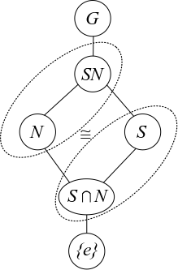

# Group Theory

## Big List of Notation

\begin{align*}
C(x) 			=       &&  \theset{g\in G \mid gxg^{-1} = x}                 &&  \subseteq G       &&  \text{Centralizer} \\
C_G(h) 		=       &&  \theset{ghg^{-1} \mid g\in G}                     &&  \subseteq G       &&  \text{Conjugacy Class} \\
Gx 			=       &&  \theset{g.x \mid x\in X}                          &&  \subseteq X       &&  \text{Orbit} \\
G_x 			=       &&  \theset{g\in G \mid g.x = x}                      &&  \subseteq G       &&  \text{Stabilizer} \\
X_{g} = && \theset{x\in X \suchthat \forall g\in G,~ g.x = x} && \subseteq X && \text{Fixed Points} \\
Z(G) 			=       &&  \theset{x\in G \mid \forall g\in G,~ gxg^{-1} = x} &&  \subseteq G       &&  \text{Center} \\
\mathrm{Inn}(G) = &&  \theset{\phi_g(x) = gxg^{-1} }                 &&  \subseteq \Aut(G) &&  \text{Inner Aut.} \\
\mathrm{Out}(G) = &&  \Aut(G) / \mathrm{Inn}(G)                      &&  \injects \Aut(G)  &&  \text{Outer Aut.} \\
N(H) 			=       &&  \theset{g\in G \mid gHg^{-1} = H}                  &&  \subseteq G       &&  \text{Normalizer}
\end{align*}

## Basics

**Definition (Centralizer)**:
$$
C_G(H) = \theset{g\in G \suchthat ghg\inv = h ~\forall h\in H}
$$

**Definition (Normalizer)**:
$$
N_G(H) = \theset{g\in G \suchthat gHg\inv = H}
$$

**Lemma:**
$C_G(H) \normal N_G(H)$

**Lemma:**
The size of the conjugacy class of $H$ is the index of its centralizer, i.e.
$$
\abs{\theset{gHg\inv \suchthat g\in G}} = [G: C_G(H)]
.$$

> Proof: Orbit-stabilizer.

**Lemma ("The Fundamental Theorem of Cosets")**:
$$
aH = bH \iff a\inv b \in H \text{ or } aH \intersect bH = \emptyset
$$

**Definition**:
$[x, y] = x\inv y\inv xy$ is the **commutator**, and $[G, G] \definedas \theset{[x, y] \suchthat x,y\in G}$ is the **commutator subgroup**.

**Lemma:**
$$
[G,G] \leq H \text{ and } H \normal G \implies G/H \text{ is abelian. }
$$

**Lemmas:**

- Every subgroup of a cyclic group is itself cyclic.

- Intersections of subgroups are still subgroups
  - Intersections of distinct coprime-order subgroups are trivial
  - Intersections of subgroups of the same prime order are either trivial or equality

- The Quaternion group has only one element of order 2, namely $-1$.

  - They also have the presentation
  \begin{align*}
  Q &= \generators{x,y,z \mid x^2 = y^2 = z^2 = xyz = -1} \\
    &= \generators{x, y \mid x^4 = y^4 = e, x^2 = y^2, yxy\inv = x\inv}
  .\end{align*}

- A dihedral group always has a presentation of the form
  $$
  D_n = \generators{x, y \mid x^n = y^2 = (xy)^2 = e}
  ,$$
  yielding at least 2 distinct elements of order 2.

## Finitely Generated Abelian Groups

Invariant factor decomposition:
$$
G \cong \ZZ^r \times \prod_{j=1}^m \ZZ/(n_j)
\quad \text{ where } n_1 \divides \cdots \divides n_m
.$$

**Going from invariant divisors to elementary divisors:**

- Take prime factorization of each factor
- Split into coprime pieces

*Example:*
\begin{align*}
&\ZZ/(2) \oplus \ZZ/(2) \oplus \ZZ/(2^3\cdot 5^2\cdot 7) \\
\cong
&\ZZ/(2) \oplus \ZZ/(2)\oplus
\ZZ/(2^3) \oplus \ZZ/(5^2) \oplus \ZZ/(7) \\
.\end{align*}

**Going from elementary divisors to invariant factors:**

- Bin up by primes occurring (keeping exponents)
- Take highest power from each prime as *last* invariant factor
- Take highest power from all remaining primes as next, etc

*Example:*
Given the invariant factor decomposition
\begin{align*}
G = {\mathbb{Z}_{2}\times\mathbb{Z}_{2}\times\mathbb{Z}_{2}\times\mathbb{Z}_{3}\times\mathbb{Z}_{3}\times\mathbb{Z}_{25}},
.\end{align*}

| $p = 2$  | $p= 3$  | $p =5$ |
|---|---|---|
|  $2,2,2$ |  $3,3$ | $5^2$

$\implies n_m = 5^2 \cdot 3 \cdot 2$

| $p = 2$  | $p= 3$  | $p =5$ |
|---|---|---|
|  $2,2$ |  $3$ | $\emptyset$

$\implies n_{m-1} = 3 \cdot 2$

| $p = 2$  | $p= 3$  | $p =5$ |
|---|---|---|
|  $2$ |  $\emptyset$ | $\emptyset$

$\implies n_{m-2} = 2$

and thus
\begin{align*}
G \cong \ZZ/(2) \oplus \ZZ/(3\cdot 2) \oplus \ZZ/(5^2 \cdot 3 \cdot 2)
.\end{align*}

**Classifying Abelian Groups of a Given Order:**

> Let $p(x)$ be the integer partition function.
>
> Example: $p(6) = 11$, given by $6, 5+1, 4+2, \cdots$.

Write $G = p_1^{k_1} p_2^{k_2} \cdots$; then there are $p(k_1) p(k_2) \cdots$ choices, each yielding a distinct group.

## The Symmetric Group

**Definitions:**

- A cycle is **even** $\iff$ product of an *even* number of transpositions.

  - A cycle of even *length* is **odd**

  - A cycle of odd *length* is **even**

**Definition**
The **alternating group** is the subgroup of **even** permutations, i.e.
$A_n \definedas \theset{\sigma \in S_n \suchthat \sign(\sigma) = 1}$ where $\sign(\sigma) = (-1)^{m}$ where $m$ is the number of cycles of even length.

>  *Corollary:*
Every $\sigma \in A_n$ has an even number of *odd* cycles (i.e. an even number of *even-length* cycles).

> *Example:*
\begin{align*}
A_4 =
&\{\id, \\
&(1,3)(2,4),
(1,2)(3,4),
(1,4)(2,3), \\
& (1,2,3),
(1,3,2), \\
& (1,2,4),
(1,4,2), \\
& (1,3,4),
(1,4,3), \\
& (2,3,4),
(2,4,3)\}
.\end{align*}

**Lemmas:**

- The transitive subgroups of $S_3$ are $S_3, A_3$
- The transitive subgroups of $S_4$ are $S_4, A_4, D_4, \ZZ_2^2, \ZZ_4$.
- $S_4$ has two normal subgroups: $A_4, \ZZ_2^2$.
- $S_{n\geq 5}$ has one normal subgroup: $A_n$.
- $Z(S_n) = 1$ for $n\geq 3$
- $Z(A_n) = 1$ for $n\geq 4$
- $[S_n, S_n] = A_n$
- $[A_4, A_4] \cong \ZZ_2^2$
- $[A_n, A_n] = A_n$ for $n\geq 5$, so $A_{n\geq 5}$ is nonabelian.
- $A_{n\geq 5}$ is *simple*.

## Counting Theorems

**Lagrange's Theorem**:

$$
H \leq G \implies \abs H \divides \abs G
.$$

*Corollary*:
The order of every element divides the size of $G$, i.e.
$$
g\in G \implies o(g) \divides o(G) \implies g^{\abs G} = e
.$$

> **Warning:**
There does **not** necessarily exist $H \leq G$ with $\abs H = n$ for every $n \divides \abs{G}$.
>
> Counterexample:
> $\abs{A_4} = 12$ but has no subgroup of order 6.

**Cauchy's Theorem**:

For every prime $p$ dividing $\abs{G}$. there is an element (and thus a subgroup) of order $p$.

> This is a partial converse to Lagrange's theorem, and strengthened by Sylow's theorem.

**Notation:**
For a group $G$ acting on a set $X$,

- $G\cdot x = \theset{g\actson x \suchthat g\in G} \subseteq X$ is the orbit

- $G_x = \theset{g\in G \suchthat g\actson x = x} \subseteq G$ is the stabilizer

- $X/G \subset \mathcal P(X)$ is the set of orbits

- $X^g = \theset{x\in X \suchthat g\actson x = x} \subseteq X$ are the fixed points

**Orbit-Stabilizer**:
$$
\abs{G\cdot x} = [G: G_x] = \abs{G} / \abs{G_x}\quad \text{if $G$ is finite}
$$

> Mnemonic: $G/G_x \cong G\cdot x$.

### Examples of Orbit-Stabilizer

1. Let $G$ act on itself by conjugation.

- $G \cdot x$ is the **conjugacy class** of $x$

- $G_x = Z(x) \definedas C_G(x) = \theset{g \suchthat [g, x] = e}$, the **centralizer** of $x$.

- $G^g$ (the fixed points) is the **center** $Z(G)$.

> *Corollary:*
> The number of conjugates of an element (i.e. the size of its conjugacy class) is the index of its centralizer, $[G: C_G(x)]$.
>
> *Corollary*: the **Class Equation**:
$$
\abs{G} = \abs{Z(G)} + \sum_{\substack{\text{One $x_i$ from} \\ \text{each conjugacy} \\ \text{class}}} [G: Z(x_i)]
$$

1. Let $G$ act on $S$, its set of *subgroups*, by conjugation.

- $G\cdot H = \theset{gHg\inv}$ is the **set of conjugate subgroups** of $H$

- $G_H = N_G(H)$ is the **normalizer** of in $G$ of $H$

- $S^G$ is the set of **normal subgroups** of $G$

> Corollary: Given $H \leq G$, the number of conjugate subgroups is $[G: N_G(H)]$.

1. For a fixed proper subgroup $H< G$, let $G$ act on its cosets $G/H = \theset{gH\suchthat g\in G}$ by left-multiplication.

- $G\cdot gH = G/H$, i.e. this is a *transitive* action.

- $G_{gH} = gHg\inv$ is a *conjugate subgroup* of $H$

- $(G/H)^G = \emptyset$

> *Application:* If $G$ is simple, $H < G$ proper, and $[G:H] = n$, then there exists an injective map $\phi: G \injects S_n$.
>
> *Proof:* This action induces $\phi$; it is nontrivial since $gH = H$ for all $g$ implies $H = G$; $\ker \phi \normal G$ and $G$ simple implies $\ker \phi = 1$.

**Burnside's Formula:**
$$
\abs{X/G} = \frac{1}{\abs G }\sum_{g\in G} \abs {X^g}
.$$

### Sylow Theorems

**Notation**:
For any $p$, let $\mathrm{Syl}_p(G)$ be the set of Sylow$\dash p$ subgroups of $G$.

Write

- $\abs{G} = p^n m$ where $(m, p) = 1$,
- $S_p$ a Sylow$\dash p$ subgroup, and
- $n_p$ the number of Sylow$\dash p$ subgroups.

**Definition**:
A $p\dash$group is a group $G$ such that every element is order $p^k$ for some $k$.
If $G$ is a finite $p\dash$group, then $\abs G = p^j$ for some $j$.

> **Lemma:**
> $p\dash$groups have nontrivial centers.

Some useful facts:

- Coprime order subgroups are disjoint, or more generally $\ZZ_p, \ZZ_q \subset G \implies \ZZ_p \intersect \ZZ_q = \ZZ_{(p,q)}$.

- The Chinese Remainder theorem: $(p, q) = 1 \implies \ZZ_p \times \ZZ_q \cong \ZZ_{pq}$

### Sylow 1 (Cauchy for Prime Powers)

\begin{align*}
\forall p^n \text{ dividing } \abs{G} \quad \text{ there exists a subgroup of size } p^n
.\end{align*}

> If $\abs G = \prod p_i^{\alpha_i}$, then there exist subgroups of order $p_i^{\beta_i}$ for every $i$ and every $0 \leq \beta_i \leq \alpha_i$.
> In particular, Sylow $p\dash$subgroups always exist.

### Sylow 2 (Sylows are Conjugate)

All sylow$\dash p$ subgroups $S_p$ are conjugate, i.e.
\begin{align*}
S_p^1, S_p^2 \in \mathrm{Syl}_p(G) \implies \exists g \text{ such that } g S_p^1g\inv = S_p^2
.\end{align*}

**Corollary**:
$n_p = 1 \iff S_p \normal G$

### Sylow 3 (Numerical Constraints)

 1. $n_p \divides m~$ (in particular, $n_p \leq m$),

 2. $n_p \equiv 1 \mod p$,

 3. $n_p = [G : N_G(S_p)]$ where $N_G$ is the normalizer.

**Corollary:**
$p$ does not divide $n_p$.

**Lemma:**
Every $p\dash$subgroup of $G$ is contained in a Sylow $p\dash$subgroup.

> *Proof:*
> Let $H \leq G$ be a $p\dash$subgroup.
> If $H$ is not *properly* contained in any other $p\dash$subgroup, it is a Sylow $p\dash$subgroup by definition.
>
> Otherwise, it is contained in some $p\dash$subgroup $H^1$.
> Inductively this yields a chain $H \subsetneq H^1 \subsetneq \cdots$, and by Zorn's lemma $H\definedas \union_i H^i$ is maximal and thus a Sylow $p\dash$subgroup.

**Fratini's Argument**:
If $H\normal G$ and $P \in \mathrm{Syl}_p(G)$, then $H N_G(P) = G$ and $[G: H]$ divides $\abs{N_G(P)}$.

## Products

**Characterizing direct products**:
$G \cong H \times K$ when

- $G = HK = \theset{hk \suchthat h\in H, k\in K}$

- $H\intersect K = \theset{e} \subset G$

- $H, K \normal G$

> Can relax to only $H\normal G$ to get a semidirect product instead

**Characterizing semidirect products**:
$G = N \semidirect_\psi H$ when

- $G =  NH$

- $N \normal G$

- $H \actson N$ by conjugation via a map
\begin{align*}
\psi: H \to \Aut(N) \\
h \mapsto h(\wait)h^{-1}
.\end{align*}

**Useful Facts**

-  If $\sigma \in \Aut(H)$, then $N \semidirect_\psi H \cong N \semidirect_{\psi \circ \sigma} H$.
- $\Aut((\ZZ/(p)^n) \cong \GL(n, \FF_p)$, which has size $- $\abs{\Aut(\ZZ/(p)^n)} = (p^n-1)(p^n-p)\cdots(p^n-p^{n-1})$.
  - If this occurs in a semidirect product, it suffices to consider similarity classes of matrices (i.e. just use canonical forms)
- $\Aut(\ZZ/(n)) \cong \ZZ/(n)\units \cong \ZZ/({\varphi(n)})$ where $\varphi$ is the totient function.
  - $\varphi(p^k) = p^{k-1}(p-1)$
- If $G, H$ have coprime order then $\Aut(G\oplus H) \cong \Aut(G) \oplus \Aut(H)$.

## Isomorphism Theorems

**Lemma:**
If $H,K \leq G$ and $H \leq N_G(K)$ (or $K \normal G$) then $HK \leq G$ is a subgroup.

> Note that this implies that $HK$ is not always a subgroup.

**Diamond Theorem / 2nd Isomorphism Theorem**:

If $S \leq G$ and $N \normal G$, then
$$
\frac{SN}{N} \cong \frac{S}{S\intersect N} \quad \text{ and }\quad \abs{SN} = \frac{\abs S \abs N}{\abs{S\intersect N}}
$$

Mnemonic:
\

> Note: for this to make sense, we also have
>
> - $SN \leq G$,
> - $S\intersect N \normal S$,

**Cancellation / 3rd Isomorphism Theorem**

If $H, K \normal G$ with $H \normal K$, then
$$
\frac{G/H}{G/K} \cong \frac{G}{K}
$$

> Note: for this to make sense, we also have $G/K \normal G/H$.

**The Correspondence Theorem / 4th Isomorphism Theorem:**
Suppose $N \normal G$, then there exists a correspondence:

\begin{align*}
\left\{
H < G \suchthat N \subseteq H
\right\}
\iff
\left\{
H \suchthat H < \frac G N
\right\}
\\
\correspond{
  \text{Subgroups of $G$} \\
  \text{containing $N$}
} \iff
\correspond{
  \text{Subgroups of the } \\
  \text{quotient $G/N$}
}
.\end{align*}

In words, subgroups of $G$ containing $N$ correspond to subgroups of the quotient group $G/N$. This is given by the map $H \mapsto H/N$.

> Note: $N \normal G$ and $N \subseteq H < G \implies N \normal H$.

## Special Classes of Groups

**Definition:**
The **"2 out of 3 property"** is satisfied by a class of groups $\mathcal C$ iff whenever $G \in \mathcal C$, then $N, G/N \in \mathcal{C}$ for any $N \normal G$.

**Definition:**
If $\abs{G} = p^k$, then $G$ is a **p-group.**

**Facts about p-groups:**

- If $k=1$ then $G$ is cyclic
- If $k=2$, then $G \cong \ZZ/(p)^2$ or $\ZZ/(p^2)$.

- p-groups have nontrivial centers
  - Proof: Use class equation.

- Every normal subgroup is contained in the center

- Normalizers grow

- Every maximal is normal

- Every maximal has index $p$

- p-groups are *nilpotent*

- p-groups are *solvable*

**Facts about other special order groups:**

General strategy: find a normal subgroup (usually a Sylow) and use recognition of semidirect products.

- $\abs{G} = pq$: Two possibilities. By cases:
  - If $p$ divides $q-1$, two cases:
    - $G\cong \ZZ/(pq)$ or $\ZZ(p)\cross \ZZ/(q)$
  - Otherwise, $G\cong \ZZ/(pq)$
  
  > Proof: Sylow theorems.
  > Note: Such groups are never simple.

- $\abs{G} = p^2q$:
  - $q \divides p^2 - 1$: Two abelian possibilities, $\ZZ/(p) \times \ZZ/(q^2)$, or $\ZZ/(pq) \times \ZZ/(q)$.
  - Otherwise, the sylow-q subgroup $H$ is normal and order $q^2$, so either $\ZZ/(q)^2$ or $\ZZ/(q^2)$.
    - Case 2: $\abs{\aut(\ZZ/(q)^2)} = q(q-1)$, so only trivial action
    - Case 1: $\abs{\aut(\ZZ/(q^2))} = q(q-1)^2(q+1)$
      - If $p$ doesn't divide $q+1$, noting new
      - Otherwise, a nontrivial semidirect product.
  

**Definition:**
A group $G$ is **simple** iff $H\normal G \implies H = \theset{e}, G$, i.e. it has no non-trivial proper subgroups.

> **Lemma:**
> If $G$ is *not* simple, then for any $N\normal G$, it is the case that $G \cong E$ for an extension of the form $N\to E\to G/N$.
> >

**Definition:**
A group $G$ is **solvable** iff $G$ has a terminating normal series with abelian factors, i.e.
$$
G \to G^1 \to \cdots \to \theset{e} \text{ with } G^{i}/G^{i+1}\text{ abelian for all } i
.$$

**Lemmas:**

- $G$ is solvable iff $G$ has a terminating *derived series*.
- Solvable groups satisfy the 2 out of 3 property
- Abelian $\implies$ solvable
- Every group of order less than 60 is solvable.

**Definition:**
A group $G$ is **nilpotent** iff $G$ has a terminating central series, upper central series, or lower central series.

> Moral: the adjoint map is nilpotent.

**Lemma:**
For $G$ a finite group, TFAE:

- $G$ is nilpotent
- Normalizers grow (i.e.$H < N_G(H)$ whenever $H$ is proper)
- Every Sylow-p subgroup is normal
- $G$ is the direct product of its Sylow p-subgroups
- Every maximal subgroup is normal
- $G$ has a terminating *Lower* Central Series
- $G$ has a terminating *Upper* Central Series

**Lemmas:**

- $G$ nilpotent $\implies G$ solvable
- Nilpotent groups satisfy the 2 out of 3 property.
- $G$ has normal subgroups of order $d$ for *every* $d$ dividing $\abs{G}$
- $G$ nilpotent $\implies Z(G) \neq 0$
- Abelian $\implies$ nilpotent
- p-groups $\implies$ nilpotent

## Series of Groups

**Definition**:
A **normal series** of a group $G$ is a sequence $G \to G^1 \to G^2 \to \cdots$ such that $G^{i+1} \normal G_i$ for every $i$.

**Definition**
A **composition series** of a group $G$ is a finite normal series such that $G^{i+1}$ is a *maximal proper* normal subgroup of $G^i$.

**Theorem (Jordan-Holder)**:
Any two composition series of a group have the same length and isomorphic factors (up to permutation).1

**Definition**
A **derived series** of a group $G$ is a normal series $G \to G^1 \to G^2 \to \cdots$ where $G^{i+1} = [G^i, G^i]$ is the commutator subgroup.

> The derived series terminates iff $G$ is *solvable*.

**Definition:**
A **central series** for a group $G$ is a terminating normal series $G \to G^1 \to \cdots \to \theset{e}$ such that each quotient is **central**, i.e. $[G, G^i] \leq G^{i-1}$ for all $i$.

**Definition:**
A **lower central series** is a terminating normal series $G \to G^1 \to \cdots \to \theset{e}$ such that $G^{i+1} = [G^i, G]$

> Moral: Iterate the adjoint map $[\wait, G]$.

> $G$ is nilpotent $\iff$ the LCS terminates.

**Definition:**
An **upper central series** is a terminating normal series $G \to G^1 \to \cdots \to \theset{e}$ such that $G^1 = Z(G)$ and $G^{i+1}$ is defined such that $G^{i+1}/G^i = Z(G^i)$.

> Moral: Iterate taking "higher centers".
