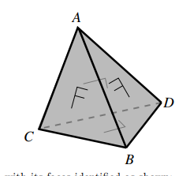
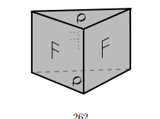
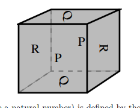

# Problems

## Homotopy

1.  Show that any non-surjective map $f: X \rightarrow S^n$ is homotopic to the constant map.
2.  Let $f,g \rightarrow S^n$ be such that $\forall x\in X, f(x) \neq -g(x)$. Show that $f \simeq g$.
3.  Let $\alpha: S^n \to S^n,~ \alpha(p) = -p$ be the antipodal map on $S^n$. Show that $n ~\text{odd} \implies f \simeq \text{id}$.
4.  Show that $X$ is homotopy-equivalent to a point $\iff$ $\text{id}_X \simeq g$ for some constant map $g$.
5.  Show that $S^1 \times I \simeq M$, the Mobius strip.
6.  Show that $\mathbb{R}^3 - S^1 \simeq S^1 \vee S^2$.
7.  Classify the letters of the alphabet up to homeomorphism, and up to homotopy.
8.  **REVISIT**
   Let $f,g : S^1 \rightarrow X$,
   $P = X \cup_f B^2 \cong X \coprod B^2 / \sim$, where $x \sim f(x)$,
   $Q = X \cup_g B^2$.
   Show that $f\simeq g \implies P\simeq Q$.

## Fundamental Group

1. Show that $x,y\in X$ path & simply-connected $\implies$ all paths from $x$ to $y$ are homotopic rel $\{0, 1\}$.
2. Show that for $X$ path connected, $\pi_1(X) = \mathbb{1} \iff \forall \text{cts.}~f: S^1 \rightarrow X$ $f$, extends to a continuous map $F: B^2 \rightarrow X$.
3. Show $\pi_1(X\times Y, (x_0, y_0)) \cong \pi_1(X,x_0) \times \pi_1(Y, y_0)$.
4. Show $\pi_1(S^n) = 1$ for $n\geq 2$.
5. Show that $S^2 - \{p_0, p_1\} \simeq S^1$.
6. Show that $S^3 - \{p_0, p_1\} \simeq S^2$
7. Show that $S^2 \not\cong S^3$.
8. For each of the following $f: S^1 \rightarrow S^1$, identify the corresponding $f_*: \mathbb{Z} \to \mathbb{Z}$:
   1. $z\mapsto z^n$
   2. $\bar{x} \mapsto -\bar{x}$
   3. $e^{i\theta} \mapsto e^{2\pi i\sin\theta}$
9. Determine the winding number of the following map: $f: S^1 \to \mathbb{C}-\{0\}, z\mapsto 8z^4 + 4z^3 + 2z^2 + z^{-1}$
10. Identify $\pi_1(M, [(1, \frac{1}{2})])$, and identify the class of $\partial M$.
11. Let $X = S^1\times S^1$ and $\gamma$ a loop based at $x_0$. What is the induced map $\gamma_\sharp$?

## Group Actions

1. Show that octagon pasting is homeomorphic to the $T = \mathbb{R}^2 / \mathbb{Z}^2$.
2. Let $x_0$ be the image of $0$, show that there is an order 6 homeomorphism $f: T \to T$ fixing $x_0$. Find a representation of $f_*$ as a matrix, and find its determinant.
3. Show that $\pi_1(K)$, the Klein bottle, is given by pairs $(m,n)$ where $(m,n)\star (p,q) = (m+(-1)^np, n+q)$
   1. Show this is torsion-free
   2. Show that $T$ is a double cover of $K$.
4. For each of these actions of $\mathbb{Z}_2$ on $S^n$, compute $\pi_1(S^n/\mathbb{Z}_2)$
   1. $S^1, z\mapsto -z$
   2. $S^2, (x,y,z) \mapsto (-x,-y,z)$
   3. $S^3, (z,w) \mapsto (-z, -w)$

## Applications

1. Let $i: \mathbb{RP}^2 \to \mathbb{RP}^3$, induced by $S^2 \hookrightarrow S^3$ as the equator. Show that $i \not\simeq \text{const}$.
2. Show that there is no map $f: S^2 \to S^1$ that commutes with the antipodal map.
3. Prove that for any $f: S^2 \to \mathbb{R}^2$, there exists $x\in S^2$ such that $f(x) = f(-x)$.
4. Prove the Ham Sandwich theorem.
5. Show that $K$ can not be a topological group.

## Van Kampen's Theorem

1. Compute a presentation of $\pi_1(T)$ and prove it is isomorphic to $\mathbb{Z}_2$.
2. (Images)
3. Show that $T-D^1 := X \simeq S^1 \vee S^1$.
   1. Show there does not exist a retraction $r: X \to \partial X$.
4. Images
5. IMages
6. Images
7. Calculate a presentation of $\pi_1(S^3-K)$
8. Show that all 3 presentations of $\pi_1(K)$ are isomorphic
   1. Square with sides glued
   2. Two mobius strips glues along boundary
   3. Multiplication rule
9. Given a group $G = <A : R>$, show how to construct a CW-complex $X$ such that $\pi_1(X) = G$.
10. Write down the fundamental group of the following spaces:
  1. $\mathbb{R}^2 - \{0, 1\}$
  2. $\mathbb{R}^2 - I$
  3. The symbol $\oplus \in \mathbb{R}^2$
  4. $S^2 - \{p_i\}_{i=1}^4$
  5. $T - \{p_0\}$
  6. $S^2 / \mathbb{Z}_2$ via the antipodal map
  7. $S^2/\mathbb{Z}_3$ via a $2\pi/3$ rotation about the $z$-axis.
  8. $S_2 \cup \{(0,0,z) \mid -1 \leq z \leq 1 \}$
  9. $\mathbb{R}^3 - \{ (x,y,0) \mid x^2 + y^2 = 1\}$
  10. $\mathbb{R}^2 - H$, the Hopf link
11. Prove that the homophony group is trivial.

## Mayer Vietoris (Sheet 7)

1. Compute the homology of:

   1. $\RP^2 = M \union_\del D^2$
   2. $T^2 = S^1 \cross S^1 = (S^1\cross I)\union_f (S^1\cross I)$
      where $(x,0) \sim (x,1) \sim (\bar x, 0) \in \CC$
   3. $S^1 \union_{f} B^2$ attached along $\del B^2$ using $z\mapsto z^n$

2. Show $\tilde H_i(\Sigma X) \cong \tilde H_{i-1}(X)$

   1. Show $\Sigma S^n \cong S^{n+1}$

3. For $f: S^n\circlearrowleft$, show $\deg f = \deg \Sigma f$

   1. Conclude $\pi_n(S^n) = \ZZ$

4. Let $\theset{A_i}^n \in \mathbf{Ab}$ be finitely generated, show $\exists X \mid H_i(X) \cong A_i$ for $i\leq n$ and 0 otherwise.

5. Suppose $X = \union_i^n A_i$ such that for any $1\leq k \leq n,~ \intersect_i^k A_i$ is either empty or contractible, show $i\geq n-1 \implies \tilde H_i(X) = 0$ and that this bound is sharp.

6. Compute $H_*(X\cross S^n)$ in terms of $H_*(X)$

   1. Compute $H_*(T^n)$

7. Let $M = (S^1 \cross B^2) \union_{\id_\del} (S^1 \cross B^2)$ and compute $H_*(M; \ZZ)$

8. Let $X = S^n\cross I$ with its ends glued together by a map $S^n \circlearrowleft$ of degree $d$, calculate $H_*(X)$.

9. Compute $H_*(X)$ for $X = S^3 - N$, with $N$ a knotted solid torus and $\del N = T$ its boundary torus

10. Let $CA$ be the cone on $A$, show that $\tilde H_*(X \union CA) \cong \tilde H_*(X, A)$.

11. Show that the Mayer-Vietoris sequence is natural, i.e.
    If $X\mapsvia{f} Y$ where $f(A) \subset C$ and $f(B) \subset D$, then this commutes:
    $$
    \begin{CD}
    H_n(X) @>>> H_n(A\intersect B) @>>> H_n(A) \oplus H_n(B) @>>> H_{n-1}(X)\\
    @VVf_*V @VVf_*V  @VVf_*V @VVf_*V\\
    H_n(Y) @>>> H_n(C\intersect D) @>>> H_n(C) \oplus H_n(D) @>>> H_{n-1}(Y)\\
    \end{CD}
    $$

## Cellular Homology (Sheet 8)

Compute the homology of these spaces

1. $S_m \vee S_n$
  1. $S^m \cross S^n$
2. A hexagon with the identifications $a+b+c-a-b-c$
3. Orientable surface of genus $g$
   1. $g=2$ is given by $a+b-a-b+c+d-c-d$
4. Nonorientable surface of genus $g$
   Obtain by removing $g$ discs from $S^2$ and attaching $g$ mobius strips
5. $S_1 \vee S_1$ with two discs attached via $(ab)^3$ and $(ab)^6$
6. This identification space:
   
7. This identification space:
   
8. This identification space:
   
9. Describe a CW complex structure for the lens space $L(p, 1)$ and compute $\pi_1, H_*$ for it.

## Degree

1. Let $p(x) = \sum_i^na_ix^i$, view $p: \CC \union \infty \selfmap$ and determine its topological degree
2. Let $p(z) = \frac{\prod_i^n z-a_i}{\prod_j^m z-b_j}$ with all $a_i, b_j$ distinct. What is its topological degree?
3. Show that if $f: S^m \into S^n$ and $\exists U \subset S^m$ such that $\restrictionof{f}{U} \cong f(U)$, then $m=n$ and $f$ is surjective.

## Universal Coefficient Theorem (Sheet 10)

1. Identify the following groups up to isomorphism
   1. $\ZZ_m \tensor \ZZ_n$
   2. $\ZZ_{60}^4 \tensor (\ZZ_{24}^3 \oplus \ZZ_8^4 \oplus \ZZ_{120})$
   3. $\ZZ_n \tensor \QQ$
   4. $(\ZZ \oplus \ZZ_n) \tensor (\QQ/\ZZ)$
2. Compute:
   1. $\tor(\ZZ \oplus \ZZ_2 \oplus \ZZ_8, \ZZ \oplus \ZZ_4 \oplus \ZZ_4)$
   2. $\ext(\ZZ \oplus \ZZ_2 \oplus \ZZ_3, \ZZ \oplus \ZZ_4 \oplus \ZZ_5)$
3. Compute the following directly from chain complexes and check using UCT:
   1. $H_*(\RP^n; \ZZ_2)$
   2. $H_*(\RP^n, \ZZ_3)$
   3. $H^*(\RP^n, \ZZ_6)$
4. For any space $X$, show that $H^1(X)$ is free abelian
5. Show that
   $H_*(X; \QQ) = H_*(X;\ZZ)\tensor \QQ$
   $H^*(X; \ZZ) = \hom(H_*(X; \ZZ), \QQ)$
6. Construct a space $X$ such that
   $H_*(X; \ZZ) = (\ZZ, \ZZ_6, \ZZ_{12}, \ZZ \oplus \ZZ_4, 0 \cdots)$
   Compute $H^*(X; \ZZ)$
7. Compute $H_*(\RP^2 \cross \RP^2; \ZZ_2)$
8. Compute $H_*(\Sigma\RP^2 \cross \RP^2; \ZZ)$
9. Compute $H_*(\RP^2\cross \RP^3; \ZZ)$
10. Let $G$ be a topological group. Show that $H_*(G)$ is an algebra. Show that $G\actson H_*(G)$, which factors through the homomorphism $G \into \pi_0(G)$ yielding a trivial action if $G$ is path-connected.

## Homological Algebra (Sheet 11)

1. Show that $\ker A \into A\tensor \QQ$ given by $a \mapsto a\tensor 1$ is the torsion subgroup of $A$.
2. Show that $A\injects B \implies A\tensor \QQ \injects B\tensor \QQ$
3. Find a free resolution of $\QQ$ as a $\ZZ$-module.
4. Compute $\tor(\QQ, A)$
   1. Compute $\tor(\QQ/\ZZ, A)$
5. 
6. Let $R = \ZZ[x,y]$, and $M = R/(x-y), N = R/(x,y)$. Construct free resolutions of $M,N$ to compute:
   - $\ext_R^*(M, M)$
   - $\ext_R^*(M, N)$
   - $\ext_R^*(N, M)$
   - $\ext_R^*(N, N)$
7. Let $\Lambda_*$ be the exterior algebra generated by the symbols $\theset{dx_i}^n$ over a field $k$. Show that letting $d  = \cdot \vee dx_1$ yields a chain complex
   $0 \into \Lambda^0 \into \Lambda^1 \into \cdots \into \Lambda^n \into 0$
   with trivial homology. Compute what happens when $dx_1$ is replaced with an arbitrary non-zero element in $\Lambda^1$.
8. Define $M$ as the group ring $R = \ZZ[\ZZ_2]$ with the action $(\cdot) \times -1$. Construct a free resolution of $M$ and compute $\tor_R^*(M, M)$.
9. Show $\tor_R^*(\cdot, \cdot)$ is symmetric in the following way:
   Given $M, N$, take free resolutions, view $M_* \into M$ as a chain map and tensor with $N_*$ to get a chain map$\psi: M_* \tensor_R N_* \into M \tensor_R N_*$. Show that $\psi$ is a quasi-isomorphism using the exact sequence
   $0 \into (Z_n, 0) \into (N_n, 0) \into (B_{n-1}, 0) \into 0$, then switch the roles of $M, N$.
10. Prove that for a SES $0\into A\into B\into C$, the group $\ext(C,A)$ classifies extensions of $C$ by $A$ up to isomorphism.

## Cohomology Ring (Sheet 12)

Todo 

